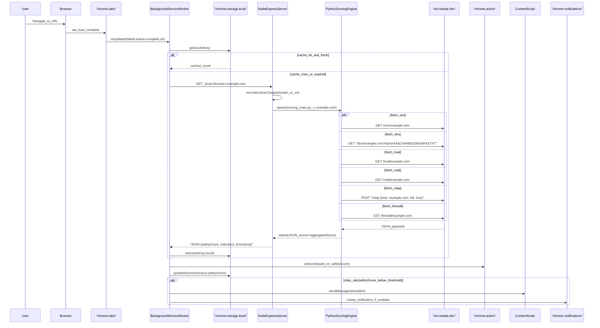
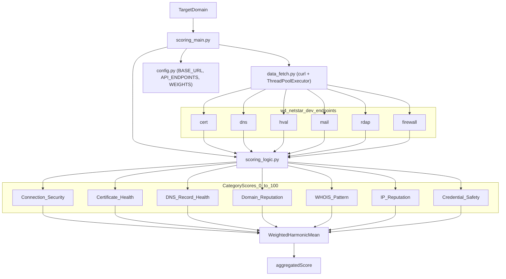

# NetSTAR Shield — System Architecture

This document describes the actual system architecture as implemented in this repository.

## Diagram 1 — Full System Architecture

```mermaid
graph TB
  subgraph browserLayer [BrowserLayer]
    direction TB
    user[User]
    popup["ExtensionPopupUI (React)"]
    sw["BackgroundServiceWorker (MV3)"]
    cs["ContentScript (InPageOverlay)"]

    storageLocal["chrome.storage.local"]
    storageSync["chrome.storage.sync"]
    actionIcon["chrome.action"]
    notif["chrome.notifications"]
    tabsApi["chrome.tabs"]

    user --> popup
    user --> tabsApi
    popup <-->|"chrome.runtime.sendMessage"| sw
    cs <-->|"chrome.runtime.sendMessage"| sw
    tabsApi -->|"onUpdated/onActivated"| sw

    sw <-->|"cache,recentScans,toggles"| storageLocal
    popup <-->|"theme,textSize"| storageSync
    sw -->|"setIcon"| actionIcon
    sw -->|"create_notification (optional)"| notif
  end

  subgraph serverLayer [ServerLayer_(SameHost)]
    direction TB
    node["NodeExpressServer (Server/server.js)"]
    py["PythonScoringEngine (Scoring Engine/scoring_main.py)"]
    node -->|"spawn_subprocess stdout(JSON)"| py
  end

  subgraph externalLayer [ExternalLayer]
    direction TB
    netstar["w4.netstar.dev"]
  end

  sw -->|"HTTP fetch GET /scan"| node
  py -->|"HTTPS curl concurrent"| netstar
```

## Diagram 2 — Scan Request Lifecycle (Auto-Scan + Side Effects)



## Diagram 3 — Extension Component Architecture

```mermaid
graph LR
  subgraph popupUI [PopupUI_(React)]
    direction TB
    popupRoot["popup.jsx"]
    tabHome[HomeTab]
    tabScan[ScanTab]
    tabDetails[DetailsTab]
    tabSettings[SettingsTab]
    tour[Tour]

    popupRoot --> tabHome
    popupRoot --> tabScan
    popupRoot --> tabDetails
    popupRoot --> tabSettings
    popupRoot --> tour
  end

  subgraph serviceWorker [BackgroundServiceWorker]
    direction TB
    bgEntry["background.js"]
    bgMessages["background/messages.js"]
    bgTabs["background/tabs.js"]
    bgScan["background/scan.js"]
    bgIcon["background/icon.js"]
    bgRecent["background/recentScans.js"]
    bgNotif["background/notifications.js"]
    bgInstall["background/install.js"]
    bgNormalize["background/urlNormalize.js"]
    bgConst["background/constants.js"]

    bgEntry --> bgInstall
    bgEntry --> bgTabs
    bgEntry --> bgMessages

    bgMessages --> bgScan
    bgMessages --> bgIcon
    bgMessages --> bgRecent
    bgMessages --> bgNotif

    bgTabs --> bgScan
    bgTabs --> bgIcon
    bgTabs --> bgRecent
    bgTabs --> bgNotif

    bgScan --> bgNormalize
    bgScan --> bgConst
    bgIcon --> bgConst
    bgRecent --> bgConst
    bgNotif --> bgConst
  end

  subgraph inPage [InPage]
    direction TB
    contentEntry["content.js"]
    overlay["ShadowDOM_Overlay"]
    contentEntry --> overlay
  end

  popupRoot <-->|"chrome.runtime.sendMessage"| bgMessages
  contentEntry <-->|"chrome.runtime.onMessage"| bgMessages
```

## Diagram 4 — Scoring Engine Data Flow (What Gets Scored)



## Diagram 5 — Deployment Architecture (As Documented in Repo)

```mermaid
graph TB
  dev[DeveloperMachine]
  repo[GitRepo]
  gha["GitHubActions CI"]
  remote["RemoteServer (VM)"]

  subgraph deployed [RemoteRuntime]
    node[NodeExpress_(Server/server.js)]
    python[Python3_Runtime]
    score["ScoringEngine (Scoring Engine)"]
    node -->|"spawn"| score
    score -->|"curl"| netstar["w4.netstar.dev"]
  end

  dev --> repo
  repo --> gha
  dev -->|"deploy.sh (ssh + tar)"| remote
  remote --> node
  remote --> python
  remote --> score

  subgraph extensionDist [ExtensionDistribution]
    unpacked["UnpackedExtension (dev)"]
    webstoreZip["netstar-shield-webstore.zip (build artifact)"]
  end

  dev --> unpacked
  dev -->|"npm_run_pack"| webstoreZip
```

