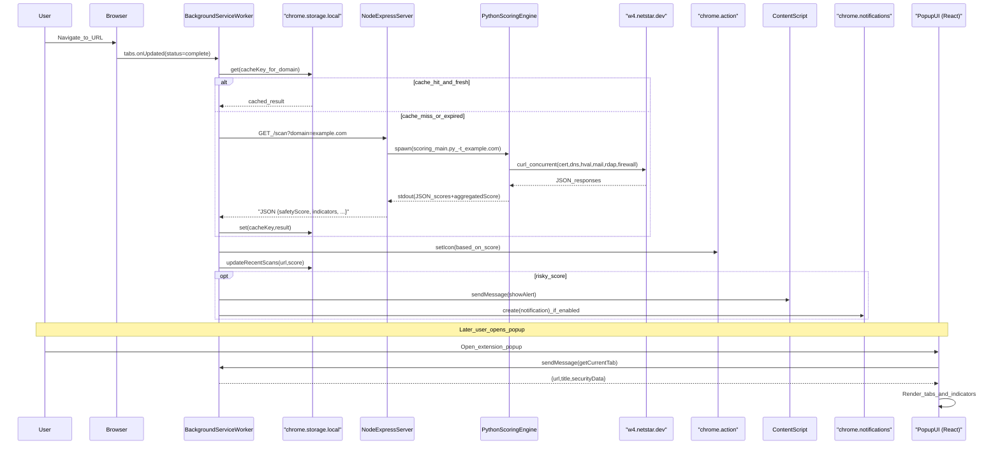

# NetSTAR Extension Architecture

This document describes the current architecture of the NetSTAR Shield browser extension as implemented in this repository.

## System Overview

```mermaid
graph LR
  subgraph browserExtension [BrowserExtension_(MV3)]
    direction TB
    popupUI["PopupUI (React)"]
    serviceWorker[BackgroundServiceWorker]
    contentScript["ContentScript (InPageOverlay)"]

    popupUI <-->|"chrome.runtime.sendMessage"| serviceWorker
    contentScript <-->|"chrome.runtime.sendMessage"| serviceWorker
  end

  subgraph browserPlatform [BrowserPlatform]
    direction TB
    tabsApi["Tabs (tabs.onUpdated/onActivated)"]
    actionIcon["ActionIcon (chrome.action)"]
    notificationsApi["Notifications (optional permission)"]
    storageLocal["chrome.storage.local (cache,recentScans,soft_toggles)"]
    storageSync["chrome.storage.sync (theme,textSize)"]
  end

  subgraph serverHost [ServerHost]
    direction TB
    nodeServer["NodeExpressServer (GET /scan)"]
    pyEngine["PythonScoringEngine (scoring_main.py)"]
  end

  subgraph externalServices [ExternalServices]
    direction TB
    netstarApi["w4.netstar.dev API"]
  end

  tabsApi --> serviceWorker
  serviceWorker -->|"update_icon"| actionIcon
  serviceWorker -->|"read/write"| storageLocal
  popupUI -->|"read/write_preferences"| storageSync
  serviceWorker -->|"may_notify"| notificationsApi
  serviceWorker -->|"fetch (HTTP)"| nodeServer
  nodeServer -->|"spawn_subprocess"| pyEngine
  pyEngine -->|"curl (HTTPS)"| netstarApi
```

## Data Flow Architecture



